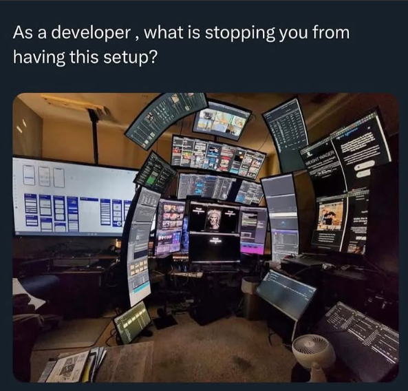

I have a borderline obsession with good dev setups. The right tools don’t just make me faster, they keep me from slowly losing my mind. This post is mainly for my future self - so I don’t have to piece everything back together when I inevitably break something - but also for anyone who wants a efficient, low-effort setup.

I think my setup is pretty cool (biased opinion, of course), after doom-scrolling GitHub repos I've finally found a set of tools that make me feel at home. Coming from years of using Linux, where I had complete control over everything, switching to macOS was a bit of an adjustment. I had to find the right tools and workflows to make macOS feel like home, and this post is a deep dive into exactly that.

## Workspace Manager

I’m a firm believer in doing everything with keyboard shortcuts. Moving a cursor around the screen every time I need to perform an action feels like a tax on my brain - slowing me down, making me feel clunky, and generally killing my flow. But as a first-time Mac user, I quickly realized that the OS wasn't designed for a keyboard-driven workflow. Before I knew it, I was three-finger swiping like a lost tourist, frantically searching across multiple "desktops" for my terminal. It was slow. It was frustrating. And worst of all, it made me feel *inefficient*.

After some furious Googling, I stumbled upon [Amethyst](https://github.com/ianyh/Amethyst). I gave Amethyst a shot, thinking, "Okay, this is probably the best I can get on macOS". But something didn’t sit right. With so many developers using Macs, surely there had to be something better - something closer to [i3](https://github.com/i3/i3).

That’s when I found [Aerospace](https://github.com/nikitabobko/AeroSpace), and it was a game-changer. It felt smooth, responsive, and most importantly, easy to configure (yes, you can configure it using Lua). Unlike other tiling window managers that feel like an afterthought on macOS, Aerospace felt intentional - like it was *actually designed* for the OS rather than fighting against it. It let me quickly snap windows into place without fuss, and it worked seamlessly across multiple displays. No more clunky trackpad swipes, and no more endless window hunting.

My workflow finally *feels right*. I’ve got a system, a rhythm, a setup that doesn’t make me want to throw my laptop out the window.

Workspace 1 → Browser

Workspace 2 → Terminal

Workspace 3 → Chat

Workspace M → Music

Workspaces 4-9 → Random chaos

[Aerospace Config](https://github.com/roerohan/.dotfiles/blob/main/aerospace/aerospace.toml)

## Spotlight

I replaced Spotlight Search with Raycast - because let’s be honest, no one is a fan of Spotlight. Half the time, it just refuses to find the file or app I know exists. It's also quite easy to set keybindings in Raycast, e.g., Cmd + Enter opens my terminal.

## Terminal

I spend an absurd amount of time in my terminal. Naturally, the default macOS terminal wasn’t going to cut it - it was ass. I’d heard a lot of buzz about Warp from social media and coworkers, so I figured I’d give it a shot.

At first, it felt... weird. Having to log in to a terminal app just to run `ls` seemed unnecessary, but I wanted to give it a fair chance. Spoiler: it didn’t win me over. The only time I found its AI remotely useful was when I used it to install Docker - when I was too lazy to copy-paste commands from my browser. Beyond that, it felt slow, didn’t add much real value, and played terribly with [tmux](https://github.com/tmux/tmux). After a month of pain, tolerance, and mild regret, I finally pulled the plug.

First, I gave [WezTerm](https://github.com/wezterm/wezterm) a shot. It was nice - smooth, fast - but straight-up **ugly** out of the box. Sure, I could make it cozy, but I’d have to configure a ton of stuff before I actually wanted to work in it. The defaults didn’t help either. The FPS was capped at 60Hz, which felt ridiculous in 2025. The font rendering was also off, and the initial experience felt like the devs expected everyone to be a power user who’d tweak it to perfection.

I wanted something that worked well out of the box with less hassle. That’s when I stumbled upon [Ghostty](https://github.com/ghostty-org/ghostty).

Ghostty was exactly what I was looking for - a terminal that just works without making me babysit a config file for hours. Right out of the box, it looked clean, felt snappy, and had buttery-smooth rendering. Just a solid, well-designed terminal. The GPU acceleration made everything feel fast, and it worked well with tmux. Plus, configuring it was refreshingly simple - no YAML rituals, just a straightforward config file with sane defaults. It felt like someone actually put thought into making a terminal that’s both powerful and pleasant to use. I was sold.

[Ghostty Config](https://github.com/roerohan/.dotfiles/blob/main/ghostty/config)

Speaking of tmux, I also use tmuxinator, which is basically a fancy wrapper over tmux scripts. It lets me set up tmux sessions how I like them without having to manually arrange windows and panes every time I start working on something. For example, I can have my first window dedicated to my editor, the second for running the server, and the third for logs, all spun up instantly with a single command. Pro tip: `alias mux="tmuxinator"`

[Tmux Config](https://github.com/roerohan/.dotfiles/tree/main/tmux)

Finally, no setup article is complete without the age-old battle over which editor reigns supreme. I’ve been through my fair share - Sublime, VSCode - until I stumbled upon Neovim. I wouldn’t say I’m married to it, but it's by far the best editor I've found so far (my apologies to Emacs allies).

Learning Vim motions was one of the best decisions I've ever made. I can edit text at the speed of thought. What started as a fun little challenge quickly turned into an addiction. If you’ve truly mastered your text editor, you don’t waste brainpower figuring out how to move around - you just shortcut your way through it. No dragging cursors. It’s like muscle memory at this point, and it lets me focus entirely on my work instead of fighting the editor. The less I have to think about how to do something, the more I can actually get done. Shoutout to [AstroNvim](https://github.com/AstroNvim/AstroNvim) for being an awesome, beginner-friendly starting point for diving into the world of Neovim. If you’ve ever wanted to try Neovim without spending hours configuring it from scratch, this is *the* way.

[Neovim Config](https://github.com/roerohan/.dotfiles/tree/main/nvim)

## Browser

As someone who spends most of their day debugging implementations of WebSockets and WebRTC, I have to talk about the browser. I really like Arc - it’s clean, the sidebar with folders and pinned tabs is a great way to stay organized, and having no traditional tab bar means more screen real estate. It feels modern, minimal, and genuinely fun to use.

But for work? Something kept pulling me back to Chrome. Maybe it’s the familiarity, Chrome’s DevTools are simply unmatched when working on real-time applications. For now, Arc is my chill, everyday browser, but when it’s time to get serious, Chrome is where the work happens.

## Your setup is never truly finished

A good dev setup is one where every tool feels like an extension of your brain rather than a hurdle to overcome. Could I still tweak things? Sure. Will I? Probably. But for now, this setup keeps me sane, helps me stay in flow, and most importantly - makes me actually enjoy the process of writing code. A setup is never truly finished - it's just temporarily good enough.
