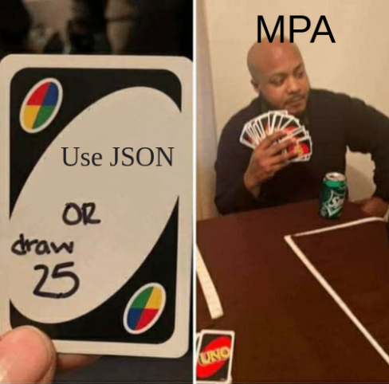

After numerous debates over the years about the "right way" of doing things, we've come to terms with building bloated bundles of Javascript - we call it _frontend development_. Today, a frontend developer has to choose between a bazillion frameworks and architectures before creating a web or mobile application. How did we get here?

## The huge divide

There is a huge divide in web development, and the debate is primarily around **SPAs** and **MPAs**. If you're a programmer today, you might not need a degree in software engineering as much as you'd need a degree in expanding acronyms.

SPAs are Single-Page Applications, the "modern" form of web development. SPA developers do not build websites, instead, they build "web apps", as they intend to provide a native app-like experience on the browser. In a SPA, you typically wouldn't have to request the server to load new pages, maybe with the exception of some minified Javascript files that should ideally be cached. The only time you would interact with the server would be to fetch dynamic data, such as a user's name.

MPA stands for multi-page application. It's known as the "traditional" form of web development where the browser needs to interact with the server to load every page. In the good old days of Web 1.0, when the browsers were incapable of handling megabytes of Javascript, this used to be an efficient way of browsing the web. MPAs might seem obsolete, but they have their own advantages, as discussed later.

In the corporate world, it seems that team SPA has dominated over the last few years, thanks to React. To most developers, especially beginners, React is synonymous with frontend web development. I do not intend to write another one of those "Framework X has ruined Javascript" articles, but it seems that the world has accepted React as the primary choice for building _all_ websites, despite the bullshit it brings alongside.

## Why SPAs suck

It does sound impressive when you illustrate the benefits of using an SPA such as fast navigation, persistent DOM, and client-side state management. However, there's a lot of garbage that accompanies React.

First, it does seem weird that you need to load potentially a megabyte of Javascript just to read a blog. In applications where most of the content is dynamic, it is simply more performant to generate the page on the server and let the client render it, instead of running tens of lines of Javascript to fetch the content and place it into the correct component.

Second, a chunk of the population [does not have a good internet connection](https://seasia.co/2019/07/12/rank-of-countries-with-fastest-and-slowest-internet-in-the-world-2019). Sure, downloading your huge Javascript bundle won't affect a portion of your users, however, in case of a poor internet connection your first load performance would be terrible if your website is a SPA.

Third, you have to maintain the same state in 2 places. Yes, I did just mention client-side state management as a feature a few sentences before, but is it really a feature? Why are you managing the same state on the server and client? It does seem counter-intuitive if you think about it, but somehow we've just accepted it. Change my mind: state duplication is the easiest way to introduce bugs in your code.

Finally, performance. We assume all the React devs out there know how `useEffect` works, but that's only partially true. A lot of the "reactive" code in SPAs is often unoptimized, leading to a number of unnecessary re-renders. I've seen my laptop's fan turn on while browsing some of the SPAs on Chrome.

Building a SPA is often overkill. It's like providing unnecessary features while harming your website's overall performance. Does that mean MPAs are the way to go?

## Why MPAs suck

The main reason why MPAs are looked down upon is that they're **traditional**. Building a MPA is uncool and not trendy. Many of us would create a monstrous blob of Javascript rather than build with a framework that's not trending.

MPAs typically have faster load times and work without loading any Javascript in most cases. There are a bunch of server-side templating frameworks that you can pick from, like [ejs](https://ejs.co/), [templ](https://github.com/a-h/templ), [tinytemplate](https://crates.io/crates/tinytemplate), and so on. These frameworks exist across all popular languages so you're not restricted to using Javascript for building your web app.

MPAs have their fair share of problems. It is a pain to have any persistent information. Imagine searching on YouTube while a video is playing in the miniplayer. It would not be possible to persist the miniplayer across pages in an MPA.

In today's web development scenario, it is quite difficult to completely avoid Javascript. You might be using Google Analytics on your website, which loads a Javascript bundle on every page load. If it's not cached, it might be worse than downloading a huge Javascript bundle on the first load (as in a SPA), as you will consistently get slower loading times.

If not managed properly, you might have a weird concoction of frontend and backend code in your repo, which will make you cry when you have to make a major refactor.

## Transitional Apps

An obvious solution is to use the appropriate architecture for different scenarios. However, there are two problems with this solution.

Web developers are strongly opinionated and loyal to their _teams_, and would never accept compromise as an answer.

Also, it's hard to decide which architecture to use. Modern websites are a blend of interactive elements and informational components and can't be classified into either category.

"Transitional apps" is a new framework for thinking about how we can get the best of both worlds, as Rich Harris talks about in [Have Single-Page Apps Ruined the Web?](https://www.youtube.com/watch?v=860d8usGC0o). It involves partial hydration, where we try to generate static pages on the server side for whatever is possible, like in MPAs, and let the client handle dynamic pages through Javascript bundles, like in SPAs. You could potentially use something like [React Server Components](https://nextjs.org/docs/app/building-your-application/rendering/server-components) or [SvelteKit](https://kit.svelte.dev/docs/introduction) to introduce server-side rendering (SSR).

My recent favorite library for such use cases has been [htmx](https://htmx.org/), as it leverages the power of hypermedia and provides a reasonable abstraction over commonly used Javascript APIs such as AJAX requests and WebSockets. You can use it with any server framework, and any templating engine. `htmx` also provides ways to tackle some of the above MPA problems. For instance, you can persist information using the `hx-preserve` attribute. Learn more about the `htmx` team's thoughts on this debate in this essay: [A Response To "Have Single-Page Apps Ruined the Web?](https://htmx.org/essays/a-response-to-rich-harris/).

I do not think `htmx` has solved the modern web development problem. However, it presents a satisfactory approach. It has become a habit to use JSON to communicate between the frontend and the backend in an attempt to decouple something that's strongly coupled. Therefore, it's harder to accept the `htmx` way of sending back the small chunks of HTML. If you think about it from a performance perspective, the client just needs to render the hypermedia delta in the right container, which is potentially the optimal approach.

## Conclusion

Modern web development has become unnecessarily complicated, but it continues to evolve and adapt, driven by a thriving community of developers who are passionate about building exceptional web experiences. I have only touched the tip of the iceberg in this article. I haven't even mentioned optimizing for mobile and **responsiveness**.

Every other week, a new Javascript framework is born, attempting to solve these problems, but it only adds to the chaos. It might not be the best idea to dive into each of these frameworks, as you'll potentially fall into the rabbit hole of Javascript Fatigue, and end up building your own framework, only to add to the madness.

No framework can (or will) last forever, JQuery couldn't, and neither will React. Stop fighting about SPAs and MPAs, embrace #transitionalapps (you'll get it if you watch the [video](https://www.youtube.com/watch?v=860d8usGC0o&t=876s)), and make the web less chaotic.
