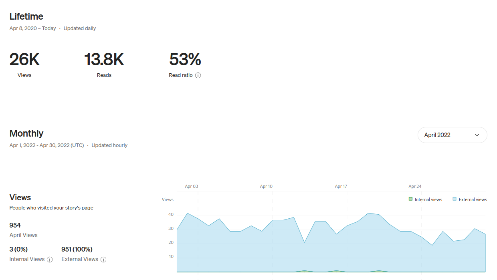
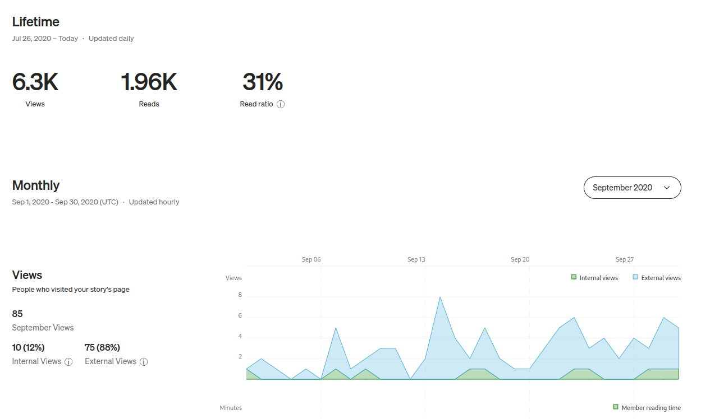
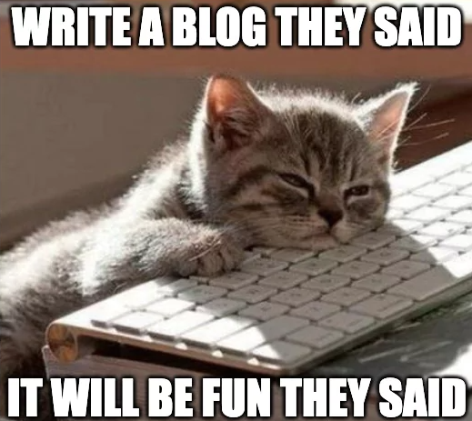

"What the hell should I write about?" \
"Why would anyone read my blog?" \
"Do I even have anything to say that's original, exciting, or different?" \
"I've never been a good writer, should I bother experimenting with this?" \
"What if my article sucks, or my grammar is bad?" \
"I'm not an expert at anything, why would anyone care about what I have to say?"

These are a few "stupid questions" that came across my mind when I first started thinking about starting my blog; possibly you did too if you ever wondered about putting yourself out there. I, for one, have always imagined that since I'm not really a pro at something, people would probably make fun of me for sharing my thoughts and opinions about it. It does sound irrational when I write it down, but that's what has stopped me from starting a personal blog.

In the past, I have written some articles that have had a decent number of views (by my standards) - like the following I had written back in 2020:

- [Make your own YouTube Downloader](https://medium.com/p/626133572429)
  
- [Structuring your Repository for CTF challenges](https://medium.com/p/9351fd47b09a)
  

Despite the relative popularity of these articles, I never felt the motivation to start my blog, or rather never got rid of the fear of sharing my thoughts and opinions about a lot of things. So, what is it that pushed me to start this personal blog?

## Documenting my work

Every software engineer understands the importance of documentation - whether you're trying to figure out how to do something, or if you want to find out what the hell you worked on last month. I've been a developer for over 4 years now, and I've explored a myriad of different technologies and tools. However, when I look back, the picture is blurry. This blog is my way of documenting what I learnt in the technical domain, so that I have something to look back to when I try to figure out what I did last quarter. Just like how you take pictures of your trips as fond memories, I plan to capture some moments in my journey - so that I can look back to what my thoughts and opinions were in the past and how they have (or have not) changed in the present.

But who the hell cares about my journey? \
I do. Nobody cares about the pictures you post on Instagram or the Tweets you share on Twitter (are we really calling it X now?), but does that ever stop you from showcasing ugly pictures of your feet on a beautiful beach destroying a gorgeous sunset? We all think that other people are looking at us and judging us, but actually, everyone is worried about their own life.

Anyway, let's assume for a second that you are the center of the universe and people have nothing better to do than judge you. If your friend were learning to design posters and they wanted to share their journey in a blog, would you judge them for that? You probably wouldn't. In fact, you might appreciate their work and share some constructive criticism so that they can improve. When you put yourself in their shoes, it seems kind of ridiculous, doesn't it?

## Embracing being a beginner

I'm **not** an expert at anything. I'm not good at blogging either, yet you happen to be reading this right now. While expert opinion is something worth listening to (in most cases), often people can learn a lot from a fellow beginner. You might have heard about the [curse of knowledge](https://en.wikipedia.org/wiki/Curse_of_knowledge). Usually, an expert assumes that all their listeners are from the same background and are familiar with what they consider "fundamentals". Sometimes, it is easier to understand something when a beginner explains it to you rather than an expert. I have watched several tech conferences and haven't understood most things since I wasn't aware of the jargon they assumed everyone knew of.

The articles that you read are not always written by experts - it's often someone who just figured something out and was excited to share it with the world. When I had written some of my articles on Medium, I was learning things in the process of writing, and it looks like whatever I came up with piqued the interests of several people.

## Clarifying my own thinking

When you write something down, it helps you clarify your own thinking. Also, I believe that teaching is the best way to learn something. That's pretty self-explanatory.

## Communicating with more people

"Communication is key" is something you might've heard at work or in your relationship. I've never been an excellent communicator - and blogging is one of the ways for me to improve. Also, the internet is amazing; you can have a conversation with someone from a different corner of the world (I'm not a flat Earther, it's just a phrase) about something both of you are passionate about. It's a humbling experience when strangers pay attention to your work and reach out to you with their questions or feedback.

Statistically, it is impossible that you're the only person in the world who is interested in something. So, no matter how niche the subject of your article is, you are certainly conveying your thoughts to someone. The network you build in this process might turn out to be invaluable.

## Experimenting and taking up new challenges

Finally, I decided to write a blog because I wanted to try it out. Since I'm not a good writer, writing articles doesn't come naturally for me - and I'm always (sometimes) up for a challenge. If you've ever written an article, you'd appreciate the effort that goes into doing the research, finding the right images (or memes), and structuring the content. It's not easy to have a personal blog, and it might not be particularly exciting for me either - it's a matter of discipline. I sure love the feeling of having written an article, but I don't like writing it; if you know what I mean.

It's an experiment that has no unfavorable outcome - if I enjoy this, well and good, but if I don't, I move on to something else because nobody gives a fuck about this blog, nor does my life depend on it.

## Conclusion

I may not have convinced you to start your blog, but sike, I never wanted to. I discussed why starting a blog might be a great idea, but it's not a piece of cake. Writing is a hard, unpaid (for most people), time-consuming, and lonely pursuit. It's a marathon, not a sprint. Before you start, you should be honest to yourself about whether the effort you put in is worth it for you.

A lot of my thoughts were inspired by [Ali Abdaal's YouTube video](https://www.youtube.com/watch?v=vyVpRiqOvt4) about writing online, make sure to check it out! If you find value in this article, feel free to share it with others who might. You can reach out to me on my social handles listed below if you want to share some feedback, or just want to chat.

